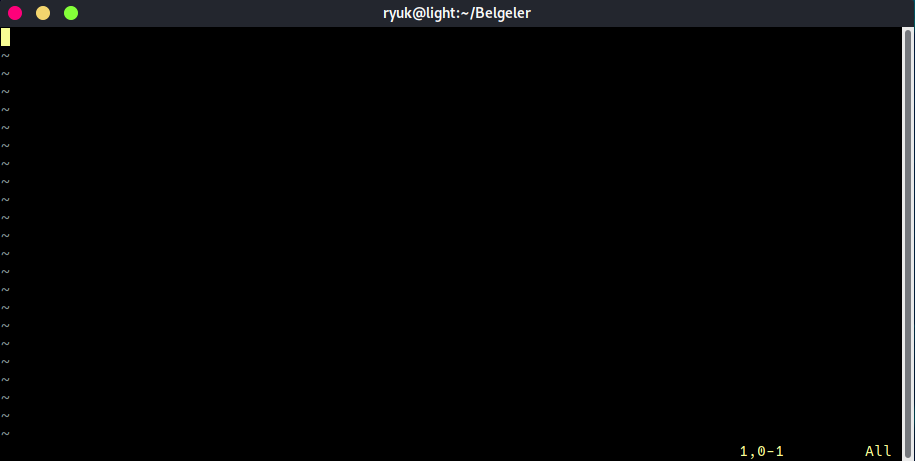

# BASH Dosyası Oluşturma

BASH dili ile çalışmalar yaparken bir dosya oluşturmamız gerek ve bu dosyanın bir BASH dosyası yani kabuk dosyası olması için bu dosya içerisinde ilk satırda özel bir ifade yer almalı. Bu ifadeyi doğru bir şekilde yazmamız için önce komut satırında bir kod çalıştırmamız gerek.



```bash
which bash
```



```
/usr/bin/bash
```




"Komut" ve "Çıktı" ifadelerini kullanarak görüntülenen sekmeyi değiştirebilirsiniz.


Bu komutun çıktısı bize BASH yorumlayıcısının adresini verir. Bu komutta kullandığımız **which** ifadesi uygulamaların bulunduğu adresi verir. Örneğin vim uygulamasının adresini bulmak için aşağıdaki komutu kullanabiliriz.



```bash
which vim
```



```
/usr/bin/vim
```



Elbette bu komutun düzgün çalışması için sisteminizde vim uygulaması yüklü olmalıdır. Benzer bir örnek daha yaparak bu komutun çalışma biçimini anlamış olalım.



```bash
which python
```



```
/home/ryuk/anaconda3/bin/python
```



Pekiyi, biz bu komutu ve çıktısını ne yapacağız? Dosyalarımızı bir BASH dosyası yapabilmek için ilk satırına o dosyanın hangi uygulama ile çalıştırılacağını yazmamız gerekiyor. Ancak bu uygulamayı yazarken PATH şeklinde belirtiyoruz. PATH kavramını eğer Türkçe'ye çevirecek olursak 'yol' anlamına gelmekte. Burada da uygulamanın yolunu temsil ediyor. Kullandığımız which komutu da bize uygulamanın yolunu verdiğine göre BASH uygulamasının yolunu alıp kabuk dosyalarımızın ilk satırına ekleyeceğiz.

Şimdi tekrar kabuk uygulamasının yoluna bakalım.



```bash
which bash
```



```
/usr/bin/bash
```



Yeni bir dosya oluşturup uzantısını '**sh**' yapalım. \(Uzantı: dosyaların biçimlerini belirten, dosya adının sonundaki noktadan sonra gelen ifade.\) Dosyamızı herhangi bir editörle açabiliriz. Ben şimdilik terminal editörü olan vim uygulamasını tercih edeceğim. Vim editörü ile dosyamızı açmak \(eğer yoksa oluşturmak\) için şöyle bir komut yazmam yeterli olacaktır.



```bash
vim hello.sh
```



Bu komut sayesinde bulunduğum dizinde bir yeni dosya oluşturuluyor ve ismi hello.sh oluyor. Hemen ardından bu dosyayı düzenlemem için vim editörü terminalde açılıyor. Açılan editörün ekranı aşağıda görülmekte.



Vim editörü ile düzenleme yapabilmek için vim editörünün kullanımını bilmek gereklidir. Bu konuya girmeyeceğim ancak İnternet'te bu konu hakkında çokça kaynak var. Bundan sonra editörün görüntüsünü değil kodların içeriğini paylaşacağım. İlaveten sizler vim editörünü kullanmak yerine herhangi bir dosya düzenleme aracını da kullanabilirsiniz. Örneğin Atom uygulaması oldukça iyidir.

Kabuk dosyamızın ilk satırına aşağıdaki satırı ekleyerek dosyanın hangi uygulama ile çalıştırılacağını söylüyoruz. Burada kullandığımız biçim diğer dosya tipleri için de geçerlidir. Yani ilk olarak \#! ifadesini ardından uygulama yolunu yazarak dosyanın hangi uygulama tarafından yorumlanacağını belirtmiş oluyoruz.



```bash
#!/bin/bash
```



Kabuk dosyasının ilk satırını bu şekilde yapıp kaydettiğimiz zaman bu dosya artık BASH ile çalıştırmaya uygun hale gelir. Ancak bu dosyanın çalıştırılması için henüz bir eksiğimiz var. Bu da dosyanın çalıştırılabilir hale getirilmesidir. Sonraki bölümde bu konuyu inceleyeceğiz.

