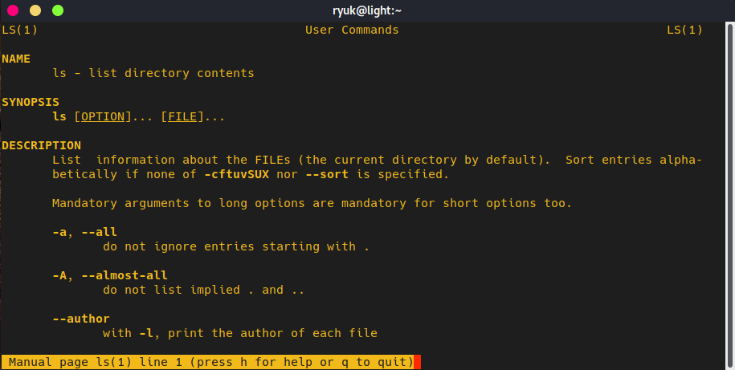
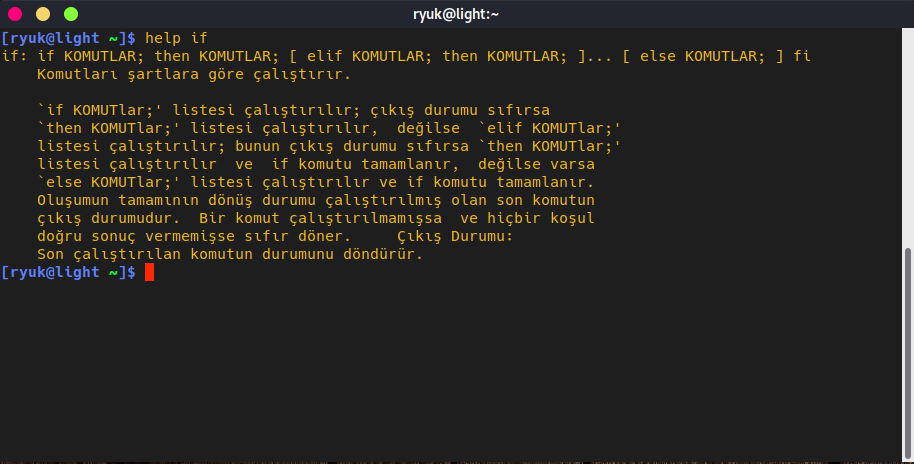
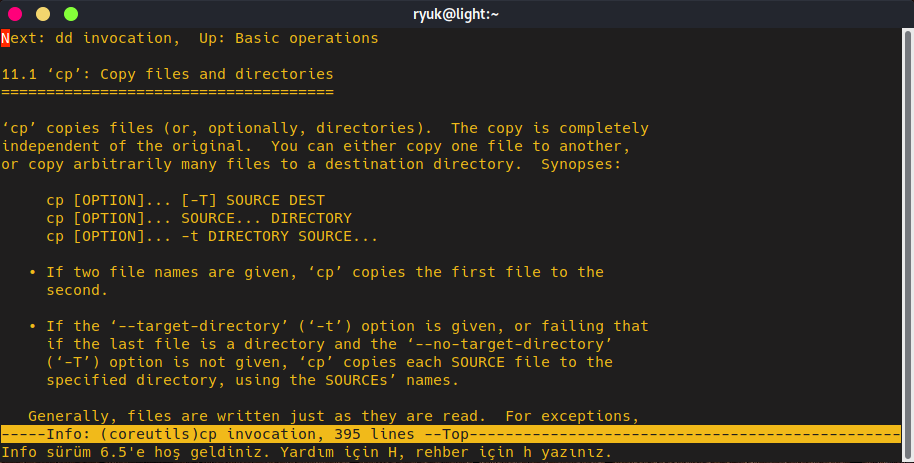
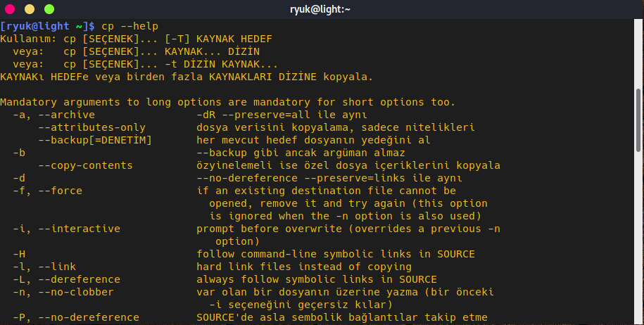

# Yardım Alma

Komutların hangi işlemi yaptığını ve hangi seçeneklerinin olduğunu daima hatırlayamayız. Bir komut hakkında nasıl kullanıldığına dair bilgi/yardım almak için kullanabileceğimiz komutlar mevcut.

Yardım almak için **man** komutu kullanılabilir. Örneğin;

```bash
man [<bölüm>] <komut>
```

Örnek bir **man** komutu çıktısı:




man komutu ile yardım alındığında sayfada satır satır ilerlemek için **Enter** tuşu, sayfa sayfa ilerleyebilmek için ara çubuğu \(_space bar_\) ya da **Ctrl+F**, geriye doğru sayfa sayfa ilerleyebilmek için **Ctrl+B** tuşları kullanılabilir. Çıkmak içi **Q** tuşuna basılmalıdır.


**help** komutu yardım almak için bir diğer seçenektir. Ancak unutulmamalıdır ki bazı komutların **man** sayfaları yoktur ve yine bazı komutların da **help** sayfaları yoktur. **help** komutunun örnek kullanımı:



_info_ ****ve &lt;_komut --help_&gt; __yardım almak için kullanılabilecek diğer bir seçenektir:



Ya da şu şekilde '**cp --help**' komut yazarak yardım alabiliriz:



